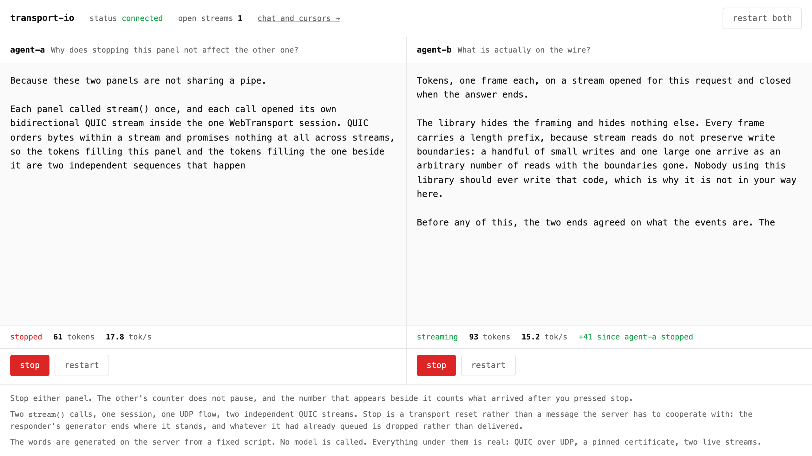

<p align="center">
  <picture>
    <source media="(prefers-color-scheme: dark)" srcset="assets/brand/transport-io-lockup-bone.svg">
    
  </picture>
</p>

Real-time apps over WebTransport. Socket.IO's shape, on a transport with multiple streams
and datagrams. Two lanes, one contract, no fallback.

```ts
import { defineContract, reliable, unreliable } from 'transport-io'
import { z } from 'zod'

export const teaser = defineContract({
  chat: reliable(z.object({ room: z.string(), body: z.string() })),
  cursor: unreliable(z.object({ x: z.number(), y: z.number() })),
})
```

`chat` will arrive. `cursor` may not. The contract is the only place that says so, and both
sides infer from it. The reliable lane is carried on QUIC streams and the unreliable lane on
QUIC datagrams.

<p align="center">
  
</p>

Two streams on one session, one of them stopped, the other not noticing. Each `stream()` is
its own QUIC stream, so the stop is a reset on one of them and costs the other nothing. That
page is [`examples/chat`](examples/chat), and both lanes are one command away with no project
and no certificate:

```bash
npx transport-io dev --demo
```

Framing, length prefixes, buffer accumulation and stream lifecycle are handled for you.
Bounds are documented rather than hidden: a streaming responder runs at most 32 frames ahead
of its consumer, and an application can reach that limit. Reliability is declared in the
contract, so "this message may be dropped" is visible in the type system.

## Use

```ts
// contract.ts - the whole surface, in one file
import { defineContract, type MapOf, reliable, rpc, streaming, unreliable } from 'transport-io'

export const contract = defineContract({
  chat: reliable<{ from: string; body: string }>(),
  cursor: unreliable<{ x: number; y: number }>(),
  save: rpc<{ text: string }, { revision: number }>(),
  ask: streaming<{ prompt: string }, string>(),
})

export interface AppMap extends MapOf<typeof contract> {}

```

`reliable` and `unreliable` take the payload. `rpc` and `streaming` take the payload and
what comes back.

Write the `AppMap` interface line. Without it, every hover shows the whole contract with
your validator's internals in it. `AppMap` is what each end is given, once,
`browserClient<AppMap>` and `createServer<AppMap>` below, and it is never inferred from
`contract`. [`API.md`](API.md) has the measurement. Registering the map globally instead is
opt-in; see
[Registering the map](https://transport-io.github.io/transport-io/getting-started/#registering-the-map-optional).

### A type, or a schema

A type argument describes the payload and costs nothing at runtime, because nothing checks
it. A peer that sends the wrong shape reaches your handler. Pass a
[Standard Schema](https://standardschema.dev) validator instead - zod, valibot, arktype -
and every inbound payload is validated on arrival, at one check per message:

```ts standalone
import { defineContract, reliable, unreliable } from 'transport-io'
import { z } from 'zod'

export const validated = defineContract({
  chat: reliable(z.object({ from: z.string(), body: z.string().max(2000) })),
  cursor: unreliable(z.object({ x: z.number(), y: z.number() })),
})
```

The payload types are inferred either way, so nothing downstream changes. Use a schema
wherever a peer you do not control can reach, which for a server is every client. Use a type
argument where both ends are yours and the traffic is high, such as cursor positions at
pointer rate.

```ts
// server
import { createServer } from 'transport-io'
import { listenHttp3 } from 'transport-io/node-transport'

// `cert` and `privKey` are the PEM text, not paths to it.
export async function serve(cert: string, privKey: string): Promise<void> {
  const server = createServer<AppMap>({ contract })

  server.handle('save', async ({ text }) => ({ revision: text.length }))

  server.handle('ask', async function* ({ prompt }) {
    for (const word of prompt.split(' ')) yield word
  })

  server.onSession((peer) => {
    void peer.join('lobby')
    peer.on('chat', (msg) => void server.to('lobby').emit('chat', msg))
    peer.on('cursor', (pos) => void server.to('lobby').except(peer.id).emit('cursor', pos))
  })

  const listener = await listenHttp3({ port: 4433, host: '127.0.0.1', cert, privKey, path: '/' })
  await server.listen(listener)
}
```

`listen(listener)` owns the accept loop, and a handshake that fails is counted in
`server.acceptErrors` rather than thrown away. Call `listen()` with no argument and drive
`accept()` yourself only when a connection has to be inspected before it is accepted.

```ts
// client
import { browserClient } from 'transport-io/browser-transport'

export async function run(url: string): Promise<number> {
  // No `certificateHash`, so the certificate is validated against the platform's CA store
  // like any other HTTPS origin. Pass one only to pin a self-signed certificate in
  // development, which is what `transport-io dev` sets up for you.
  const client = await browserClient<AppMap>({ contract, url })

  client.emit('chat', { from: 'me', body: 'hello' }) // arrives
  client.emit('cursor', { x: 12, y: 40 }) // may not
  const { revision } = await client.call('save', { text: 'hi' })
  return revision
}
```

`browserClient` constructs and connects, and resolves to a connected client. `devClient` and
`http3Client` are the same shape for local development and for Node.

`new Client({ contract, connect })` is still there, and the rule for choosing is that the
one-call form hands back a client that is *already connected*. Anything needing it before
then constructs it itself: a transport of your own, React, or a page that renders
`connecting`.

An event can answer with a **sequence** instead of a value. Declare `yields` instead of
`returns`, write an async generator, consume an async iterable:

```ts
import type { Client } from 'transport-io'

export async function render(client: Client<AppMap>, prompt: string): Promise<string[]> {
  const out: string[] = []
  for await (const token of client.stream('ask', { prompt })) {
    out.push(token)
    if (out.length === 20) break // resets the stream, and the handler's `finally` runs
  }
  return out
}
```

`break` is the cancel: leaving the loop resets the QUIC stream, which fires the handler's
`ctx.signal`. The generator does not resume until its frame is accepted, and the producer
may be at most 32 frames ahead of what the consumer has taken.

The loop above is `take(20).toArray()` written out. Four helpers exist for the cases where a
loop reads worse than the thing it is doing, and `cancel()` stops a stream from outside its
loop, which is what a stop button needs:

```ts
export async function withHelpers(client: Client<AppMap>, stop: { onclick: () => void }): Promise<void> {
  const first20 = await client.stream('ask', { prompt: 'hello' }).take(20).toArray()
  console.log(first20.length)

  const generation = client.stream('ask', { prompt: 'hello' })
  stop.onclick = () => generation.cancel()
  await generation.forEach(async (token) => void console.log(token))
}
```

A wrong event name or payload fails to compile. The error names the event instead of
unrolling the contract type.

**React:** [`@transport-io/react`](https://www.npmjs.com/package/@transport-io/react) is the
binding, published separately.

### Local development

For your own project, `transport-io dev ./server.ts` mints the certificate, publishes its
hash for the browser to pin, and hands the certificate to your server. It does not bundle
your browser code: that needs a bundler, and this package takes no runtime dependencies for
its CLI, so keep running your own and point `--static` at the output.

## Limitations

None of these are going to change. [`KNOWN-ISSUES.md`](KNOWN-ISSUES.md) has the reasoning
and the measurements behind each one, and is worth reading before you build on this.

- **WebTransport only.** No WebSocket fallback, because a fallback would silently make the
  unreliable lane reliable and ordered. An unsupported runtime gets `WT_NO_SUPPORT`.
- **Chrome and Firefox.** Safari ships WebTransport and cannot talk to a quiche-backed
  server. Unsupported until that is fixed upstream.
- **UDP has to reach your process.** No proxy in front of it, no CDN, and no load balancer
  that forwards only TCP.
- **Reconnect is a new session.** Room membership does not survive it and pending calls
  reject. Resubscribing is the application's job.
- **Datagrams may be dropped, duplicated or reordered**, and loss is not reported.
- **Each bidirectional stream leaks about 5.95 KB of server memory**, upstream in the QUIC
  binding rather than in this library. `emit` and datagrams are flat. It is the one measured
  defect, and it is what stands between this and a 1.0.
- **The protocol is v0.** Both sides must match exactly.
- **One event name serves both directions**, which is a modelling tax when the two directions
  want different payloads.

The certificate rule, the native package and the Safari gap are shared with Socket.IO's
WebTransport transport. They are properties of the stack, and the comparison below says so.

**Not in this version:** namespaces (a room-name prefix covers it), presence, middleware chains
(auth is one hook), binary payloads (JSON only, with a codec seam reserved), server-initiated
streaming (a response shape only), framework bindings, and the Redis adapter.

## Compared with Socket.IO

Socket.IO has supported WebTransport since 4.7.0, released in June 2023. Everything in this
section comes from Socket.IO's own documentation and source, linked at the end, so each line
can be checked.

**Where Socket.IO is the better choice.** Socket.IO falls back to WebSocket, and then to HTTP
long-polling. Safari works, and so do networks that block UDP. transport-io has no fallback:
an unsupported browser or a UDP-blocked path gets `WT_NO_SUPPORT` and nothing else. If you
have to support Safari, or cannot rely on UDP reaching your server, use Socket.IO. Socket.IO
also guarantees ordering across a transport upgrade, buffers client events across a
reconnection, offers at-least-once client-to-server delivery with `retries`, and has
namespaces, middleware, a Redis adapter and years of production use. transport-io starts a new
session on reconnect, keeps no buffer, and has rooms and an in-memory adapter.

**What is the same.** Both servers need the same native QUIC package,
`@fails-components/webtransport`, because Node has no WebTransport of its own. Both are bound
by the same rule for a self-signed development certificate: ECDSA, at most fourteen days.
Neither reaches Safari over WebTransport. The install caveats further down this page are
properties of the transport stack, not of either library.

The differences that can be checked in their source:

| | Socket.IO | transport-io |
|---|---|---|
| Streams | One bidirectional stream per session, carrying every Engine.IO packet behind a length header. The protocol forbids a client from opening a second one. | The emit lane on one stream per direction, and a fresh bidirectional stream for every `call` and `stream`. |
| Datagrams | Not used. | The unreliable lane. |
| Acknowledgements | An incrementing id per request and a map from id to callback on each side; the ACK packet carries the id back. | The stream is the correlation. No id, no map. |
| Cancelling a request in flight | `timeout()` rejects locally after a delay and removes the map entry. Nothing is sent to the peer, whose handler continues. | An `AbortSignal` or `cancel()` resets the QUIC stream. The responder's `signal` fires and its generator's `finally` runs. |
| Reliability in the types | Events are typed as function signatures and nothing marks delivery. `volatile` is a runtime modifier: the event is discarded if the transport is not writable at that moment, and sent normally otherwise. | `reliable` or `unreliable` on each event in the contract. The lane is a type. |
| Head-of-line blocking | Every packet on the session is one ordered sequence, so a lost packet stalls what is queued behind it. | Each call and each stream is its own QUIC stream; one stalled call does not delay another. |
| Typed setup | Four interfaces, `ServerToClientEvents`, `ClientToServerEvents`, `InterServerEvents` and `SocketData`, with the two event interfaces passed in opposite order on the server and the client. | One contract, one `MapOf` line, and the same name at each end. |

Sources: the [4.7.0 changelog](https://socket.io/docs/v4/changelog/4.7.0), the
[WebTransport guide](https://socket.io/get-started/webtransport), the
[Engine.IO protocol](https://socket.io/docs/v4/engine-io-protocol/) and its
[client](https://github.com/socketio/socket.io/blob/main/packages/engine.io-client/lib/transports/webtransport.ts)
and [server](https://github.com/socketio/socket.io/blob/main/packages/engine.io/lib/server.ts)
transports, the [parser](https://github.com/socketio/socket.io/blob/main/packages/engine.io-parser/lib/index.ts)
that writes the length header, the
[client](https://github.com/socketio/socket.io/blob/main/packages/socket.io-client/lib/socket.ts)
and [server](https://github.com/socketio/socket.io/blob/main/packages/socket.io/lib/socket.ts)
socket classes for acknowledgements and `timeout()`, the
[emitting events](https://socket.io/docs/v4/emitting-events/) page for `volatile`, the
[TypeScript guide](https://socket.io/docs/v4/typescript/), and the
[delivery guarantees](https://socket.io/docs/v4/delivery-guarantees/) page.

## What is different

**Acknowledgements are streams.** Each `call` opens its own bidirectional stream: write the
request, half-close to end it, read until the peer closes. The stream is the correlation, so
there are no acknowledgement identifiers, no pending-callback map and no timeout tracking. A
stalled call does not block other calls. Cancellation is a QUIC stream reset, which costs no
application message and reaches the responder's signal without the client sending anything.

**Responses can be sequences.** An event declaring `yields` answers with an async iterable
instead of a value. Leaving the loop resets the QUIC stream, which fires the handler's
`ctx.signal` and runs its `finally`. The producer runs at most 32 frames ahead of what the
consumer has taken. That bound is this library's own accounting, not the transport's.

**No default call timeout.** A dead peer is detected by the QUIC idle timeout, which rejects
every pending call. Pass `AbortSignal.timeout(ms)` when you want a deadline.

**A documented wire protocol.** [`PROTOCOL.md`](PROTOCOL.md) is written so someone can
implement an interoperable server in another language without reading this source.

**No infrastructure required.** `MemoryAdapter` is the default. If you write your own
adapter, `transport-io/testing` exports `HostileAdapter`, which serialises frames through
bytes, adds latency, reorders, duplicates and fails on command.

## Install

```bash
npm install transport-io
```

Browsers need nothing extra. The server needs a native QUIC package, and the details below
are what will surprise you in CI. They apply to any WebTransport server on Node, not only
this one.

<details>
<summary><strong>The native package, glibc, git installs, and what contributors need</strong></summary>

Installing from git does not work. The repository root is a private package called
`transport-io-monorepo`, so `npm install github:transport-io/transport-io` installs that
instead and `import … from 'transport-io'` fails. To work on the library itself, clone it:

```bash
git clone https://github.com/transport-io/transport-io
cd transport-io && npm install && npm run build
```

The server also needs the native QUIC transport, which is a **separate, deliberate
install**:

```bash
npm install @fails-components/webtransport-transport-http3-quiche
```

It is not a dependency of anything, only a dynamic import, so no package manager will pull
it in for you. Browsers need nothing extra - they use the platform's own WebTransport.

Two things about that native package are worth knowing before CI surprises you:

- **Its prebuilt binaries come from GitHub Releases, not npm.** A registry mirror alone is
  not enough. Pin the version exactly and cache the download.
- **The Linux prebuild needs glibc 2.38.** Every default Node slim image is currently
  byte-identical to its Debian bookworm variant, which ships glibc 2.36 and will not load
  it. Use a `trixie` variant or Ubuntu 24.04. There is no musl build at all, so Alpine
  falls back to a source compile.

**Consumers** need Node 22 or newer, and TypeScript 5.0 or newer - gated by `const` type
parameters in the public types, and checked in CI.

**Contributors** additionally need [Bun](https://bun.sh) and `openssl` on `PATH`. Bun runs
the unit tests, the documentation gate and the example build; `openssl` mints the
short-lived certificate the browser needs for WebTransport. Neither is optional: `npm
install` succeeds without Bun and then the first `git commit` fails, because the hooks shell
out to it. Development is supported on macOS and Linux only - Windows contributors should
use WSL.

</details>

## Documentation

- [`KNOWN-ISSUES.md`](KNOWN-ISSUES.md) - **read this before you start**: what this library
  refuses to do and will not change, plus the one measured defect
- [`PROTOCOL.md`](PROTOCOL.md) - the wire format
- [`API.md`](API.md) - the TypeScript surface
- [`DECISIONS.md`](DECISIONS.md) - every question this project raised, answered
- [`ADR/`](ADR) - the records a future contributor would want to reverse
- [`examples/chat`](examples/chat) - both lanes in one page, and two streaming calls
  running at once in another, where stopping one leaves the other untouched

## Licence

MIT, for the source code.

The name and the marks in [`assets/brand`](assets/brand) are **not** covered by it.
Copyright and trademark are separate, and MIT speaks only to the first, so the carve out is
stated in [`assets/brand/LICENSE`](assets/brand/LICENSE). Short version: use the marks to
refer to this project, not as the mark of your own. Forking is welcome, under your own
name.
